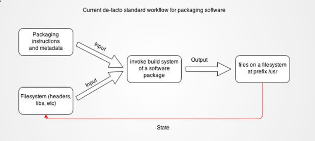

# Our story
* You're a developer at a big bank.
* You have packages with complex dependencies
* You want the assurance that if package builds on your machine, it builds in CI, and in production
* _High assurance_

---

# Our Mission
* We're maintainers of a legacy COBOL codebase, which handles authentication within the bank
* Company is moving to _micro services_ architecture, because manager says so
* Other applications written in _Python_ and _Java_
* We're responsible for _smooth_ releases

---

---

# Packaging problems
## A current state of affairs - (Raise hands if you had one of these issues!)
* I install a project but it doesn't compile, whilst it did install on a collegues machine
* I modified some file like `/etc/nginx/nginx.conf` and now `apt upgrade` aborts, because
  it tries to override an existing file.
* Computer runs out of battery during `apt upgrade`, and now my whole system is F*$#kd

---

# Packaging problems
## What is the root cause of all these issues?

* 

---

# Solution 1
## Docker

---

---

# NixOS - A configuration management tool
## Problems with existing tools like Chef / Ansible / Puppet
* Just like with package management, output state depends on current state
* Your playbooks might depend on implicit state
* Playbooks might diverge with what is actually on the system
* Package manager might even _fight_ against the configuration manager!

---

# NixOS - A configuration management tool
## Anecdote
* Ansible modifies `/etc/nginx/nginx.conf`
* Ansible enabled auto upgrades of packages
* Upgrade of apt overrides `/etc/nginx/nginx.conf
* Stuff silently fails
* Rerun ansible,  stuff converges again...

---

# NixOS - A configuration management tool

Okay, we need to add code example here.

---

# NixOS - A configuration management tool
* Reliable upgrades & consistency
* Immutable OS, pinned to a specific git commit in your repo
* Atomic upgrades and rollback (Your OS is just another Nix package!)
* INFRASTRUCTURE AS CODE. TRULY

---

# NixOS - A Configuration management tool
* Downside: You need to fully buy into Nix. hard to sell?
* In that case, just build Docker containers instead, like shown before
* Could for example us NixOS, to set up your kubernetes cluster
* Other collegues can keep existing Docker based images
* You can use Nix

---

# NixOps - infrastructure management tool
* Again, same problems of package mangement, arise in infrastructure management
* Before, people click around UI to create things
* Now, a pure function from datacenter description, to an actual datacenter!
* Create NixOS VMs
* ... Load balancers
* ... DNS Records
* ... Storage buckets

---

# Downsides of Nix
* Steep learning curve. Thinking functionally is something to get used to
* You _Can not_ do dirty hacks.  You can't go monkeypatch some python package in `/usr/lib/python`, or update `/etc/hosts` manually 
* Ok.. maybe the above is a Pro. But it forces you to do things properly. Which might be slow
* Install can get large, as multiple people have multiple versions of packages
* Documentation is ... not always great. "Read the source code" is a common philosophy among Nix'ers
* However, this forces you to actually learn the tool, and gives great flexibility to you

# Questions?
* [https://nixos.org/nixos/nix-pills - Tutorial to get up to speed quickly with how nix works](https://nixos.org/nixos/nix-pills)
* [https://nixos.org/nix](https://nixos.org/nix)
* [https://nixos.org/nixos](https://nixos.org/nixos)
* [https://nixos.org/nixops](https://nixos.org/nixops)
* [https://github.com/nixos](https://github.com/nixos)
* [\@ProgrammerDude - Stalk me on Twitter](https://twitter.com/ProgrammerDude)
* [https://github.com/arianvp - Stalk me on Github](https://github.com/arianvp)

